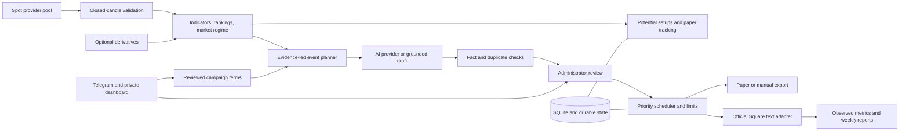

# Square Desk: Binance Square creator operations

Square Desk is a separate deployable Python application beside the existing ATLAS bot. It collects real market observations, identifies events, produces reviewable content and charts, records paper setups, manages campaigns, schedules publications and provides Telegram administration. Nothing trades real money. Paper mode and human approval are the defaults.

This is an implemented operations core, not a claim that every data source or platform feature in the master prompt is connected. Read the integration boundaries below before launch.

## 1. Requirements and verified assumptions

Accuracy, reputation protection and evidence freshness override output volume. The operational default is twelve publications as a ceiling per day, two per hour, and thirty minutes between submissions. Change these using environment variables; fifty is supported as a target ceiling, never a quota to fill. Low event volume produces an occasional educational draft or no post.

Official documentation checked on **1 October 2026**:

- [Square posting guide](https://www.binance.com/en/square/post/298569766519442): dedicated creator posting key, default daily cap of 100 successful publications. The page describes text posts.
- [Binance's official Square integration source](https://github.com/binance/binance-skills-hub/tree/main/skills/binance/square-post): current source also describes articles and media; the implemented Python adapter follows its text/article request contract. Account eligibility and capabilities still need a controlled live check.
- [Community guidelines](https://www.binance.com/en-AE/support/faq/detail/ecb50ef2012f40b2a2c4f72eaa5b569f): authenticity, original content, sponsorship disclosure and avoidance of platform abuse. A technical API cap is not permission to spam. Educational source attribution is retained.
- [Spot REST limits](https://developers.binance.com/en/docs/products/spot/rest-api): live exchange metadata exposes limits; requests must respect backoff responses.
- [Official market-only endpoints](https://github.com/binance/binance-spot-api-docs/blob/master/faqs/market_data_only.md): unauthenticated public spot observations.
- [Coinbase candles](https://docs.cdp.coinbase.com/api-reference/exchange-api/rest-api/products/get-product-candles) and [limits](https://docs.cdp.coinbase.com/exchange/rest-api/rate-limits): bounded public candle history; gaps can exist. We reject gaps rather than fill them.
- [Binance derivatives](https://developers.binance.com/en/docs/catalog/core-trading-derivatives-trading-usd-s-m-futures/api/rest-api/market-data): optional public funding and open-interest context.
- [Telegram Bot API](https://core.telegram.org/bots/api): private administrator commands and webhook secret verification.
- [Render free hosting](https://render.com/docs/free) and [persistent disks](https://render.com/docs/disks): free instances have inactivity and ephemeral-storage constraints. The supplied deployment uses a paid service with a persistent disk.

The posting API documentation and the broader platform guidelines have different scopes. This implementation uses the dedicated official posting interface, conservative caps and a review gate. Recheck rules and account restrictions before enabling live posting. Set `DESK_POLICY_REVIEWED` to the date you reviewed them; live mode stops when that review expires. These checks are engineering safeguards, not a guarantee of moderation acceptance or legal advice. Verify provider usage and redistribution terms for your account and region before commercial use; no commercial license is inferred from public access.

## 2. Architecture and information flow



Each market value retains venue, quote currency, candle interval and observation time. A Coinbase USD candle is never presented as Binance USDT data. Long-window candles must have the same source and quote as short-window candles; mismatched observations are withheld. The configured watchlist is at most thirty symbols, default eight, to control cost and memory. Rankings describe that watchlist, not the entire crypto market.

The worker scans on a bounded interval, updates paper outcomes, chooses a small event subset and persists drafts. The queue is rebuilt in descending priority so urgent content takes the first available compliant slot. Market drafts expire instead of becoming evergreen claims. Educational content can use measured audience windows when sufficient performance observations exist.

Telegram commands validate sender and private chat, persist update IDs and change the database. The scheduler then reacts to durable state. HTTP controls use a private Basic-authenticated dashboard. Telegram and web actions never publish directly outside the scheduler's gates.

Publication state changes to `sending` before the remote request. A successful receipt is persisted. Timeout, ambiguous response or restart during transmission becomes `uncertain`, requiring human reconciliation; there is no blind automatic POST retry.

## 3. Repository structure

| File | Responsibility |
|---|---|
| `square_desk/config.py` | Validated environment configuration and safe public settings |
| `models.py` | UTC timestamps, closed candle and snapshot validation |
| `store.py` | Indexed SQLite repository, transactions, budgets, audit and worker lease |
| `providers.py` | Public Binance/Coinbase adapters, failover, cache and cooldown |
| `derivatives.py` | Optional Binance funding, OI and OI history with freshness checks |
| `analysis.py` | EMA, Wilder RSI/ATR, MACD, VWAP, levels, regime, rankings and events |
| `tracking.py` | Conservative paper outcomes and statistics |
| `content.py` | AI abstraction, evidence tokens, deterministic fallback and validation |
| `education.py` | Original evergreen educational material |
| `news.py` | RSS candidate monitoring, source classification and reviewed news drafts |
| `images.py` | Real candle PNG charts and editorial cards |
| `campaigns.py` | Strict term parsing, activation, expiry, quotas and draft creation |
| `compliance.py` | Caps, spacing, publishing windows and live review gate |
| `scheduler.py` | Priority allocation and conflict resolution |
| `publisher.py` | Paper/manual export and official Square text/article adapter |
| `telegram.py` | Allowlisted commands, webhook/polling and durable delivery queue |
| `analytics.py` | Imported observed metrics, paper reports and bounded learning |
| `service.py` | Worker lifecycle, scan orchestration and weekly reports |
| `app.py`, `dashboard.html`, `dashboard.js` | Private API/dashboard and health service |
| `tests/test_square_desk.py` | Mocked safety, persistence and integration checks |
| `requirements-square.txt`, `render-square.yaml` | Lean independent runtime and deployment |
| `scripts/square_probe.py` | Read-only real-provider connectivity check |

ATLAS remains launched by its existing command. Launch this application with `python -m square_desk`. Use a separate Telegram bot if ATLAS is already consuming updates from your existing bot.

## 4. Database schema and persistence

SQLite with WAL is chosen for a low-cost, single-instance Render service. `Store` isolates persistence from the business modules. PostgreSQL is not implemented in this version; multi-instance scaling requires a transactional replacement repository and equivalent worker/queue locks.

| Table | Fields | Purpose |
|---|---|---|
| `entities` | id, kind, status, created, updated, due, fingerprint, JSON payload | Snapshots, signals, drafts, campaigns, source records, reports, account observations, commands and outbox |
| `state` | key, JSON value | Pauses, cache, offsets, runtime settings, cooldowns, worker lease and weekly markers |
| `budgets` | day, category, used | Durable AI and image cost reservations |
| `audit` | id, at, category, correlation, message | Redacted operational history |

All publications have UUIDs. Fingerprints are unique per entity kind where supplied. Indexed kind/status/due and kind/created columns make queue and time-window reads bounded. Full payloads preserve the evidence used by a draft. Failed paper setups are never deleted to improve reported performance. Snapshots/audit records and generated artifacts have retention rules; durable publication and signal records remain.

Draft flow: `review → approved → queued → sending → published | paper_published | manual_ready | uncertain`. Rejections stay recorded. Expired market evidence or campaigns stop scheduling. Editing text, terms or images invalidates earlier approval. Imported real metrics cannot be attached to paper posts.

## 5. Configuration

`.env.square.example` contains variable names only. Blank values use validated defaults. Copy it to `.env.square`, then fill only what you need. Both files are separate from ATLAS configuration; actual secrets remain ignored by Git.

Important defaults:

| Setting | Default |
|---|---|
| `DESK_PAPER_MODE` | `true` |
| `DESK_LIVE_ENABLED` | `false` |
| `DESK_MODE` | `approval`; alternatives `hybrid`, `automatic` |
| `DESK_TIMEZONE` | `Asia/Kolkata` |
| `DESK_DAILY_TARGET` | `12`, bounded by platform/policy caps |
| `DESK_PLATFORM_DAILY_CAP` | `100` or lower configured limit |
| `DESK_HOURLY_CAP`, `DESK_GAP_SECONDS` | `2`, `1800` |
| `DESK_PUBLISHING_HOURS` | Local hours `7` through `23` inclusive |
| `DESK_SCAN_SECONDS` | `300`, minimum `60` |
| `DESK_DRAFT_MAX_AGE`, `DESK_CANDLE_MAX_AGE` | `1800`, `1200` seconds |
| `DESK_MIN_CONFIDENCE` | `75`, heuristic score, not probability |
| `DESK_MIN_RELATIVE_VOLUME` | `1.5` |
| `DESK_MIN_QUOTE_VOLUME` | `100000`, estimated candle quote turnover |
| `DESK_MAX_DRAFTS_PER_SCAN` | `3`, queue capped at fifty pending drafts |
| Post/article words | `100–200` / `1000–2000` |
| Daily image/article/campaign caps | `25` / `2` / `5` |
| AI request/token reservations | `30` / `40000` daily |
| Similarity threshold | `0.78` |
| Simulated fees/slippage per side | `10` / `5` basis points |
| Weekly report | Sunday, `20:00` local |
| `DESK_RETENTION_DAYS` | `30` for raw snapshots/audit/generated files |
| `DESK_ENABLE_DERIVATIVES` | `false` |
| `DESK_NEWS_FEEDS` | Empty; optional comma-separated official RSS URLs |

Set `DESK_ADMIN_TOKEN` to a strong random value. Dashboard login is username `desk`, password that token. Without a token, private routes refuse access. `/health` is public and reveals only a minimal liveness result. `/health/details` is authenticated and includes worker/data/provider state.

Live configuration, AI endpoint credentials and Telegram secrets are deployment environment settings. They cannot be enabled or edited through ordinary Telegram commands. `/set` can change only the three bounded publication caps, which persist across restarts. Lowered compliance caps remain independent of business targets.

## 6. Market adapters, caching and failure handling

`MarketDataProvider` is a protocol; `ProviderPool` tries the configured order, then a still-fresh cached observation. Binance requests official market-only endpoints and checks exchange metadata. Coinbase uses native USD candle observations. Closed fifteen-minute candles drive short windows; closed hourly candles cover longer windows. Missing or discontinuous candles are rejected. No proxy, identity rotation or geographical workaround exists.

The shared HTTP transport serializes requests per host, spaces them conservatively, caps retries at three and backs off exponentially for transient read failures. Restriction and rate-limit responses suspend requests for the provider's cooldown. A fresh cache keeps its original timestamp. When every eligible source fails, numerical content is withheld and Telegram receives a deduplicated alert.

Provider priority is configurable. Derivative data has a separate optional interface and stays null if inaccessible. Liquidations, whale attribution and on-chain activity have no live adapter here; no corresponding factual claims are manufactured. RSS polling is hourly with conditional headers and bounded body sizes. Feed entries are unconfirmed candidates, never automatic breaking-news facts.

## 7. Signals and paper laboratory

The scanner calculates actual candle-based change, relative volume, approximate quote turnover, Wilder ATR/RSI, EMA structure, MACD, trailing VWAP, support and resistance. The range excludes the current candle. A potential setup needs a range break, volume expansion, minimum liquidity proxy, trend/RSI agreement and available BTC/ETH context. Opposing BTC regimes block the setup.

Signals include direction, reference entry zone, stop/invalidation, projected targets, ATR, RSI, volume, context, timestamps, source and the reason. Confidence is an explicit heuristic screening score. It has not been calibrated as a probability or validated as a profitable strategy. A short scenario is analytical context, not an executed spot short. Funding/OI are stored when available; unavailable liquidation context stays null.

Every qualifying unique setup enters a paper record. A later retest can trigger it; time/invalidation can reject it. Tracking preserves venue and quote consistency. Missing history becomes unresolved. It never guesses a win from an absent candle. OHLC ambiguity uses stop-first ordering, with no same-entry-bar target wins. Stop gaps use an adverse opening-price fill. Fees and slippage are included; funding is not simulated. The full modeled position exits at the first target. The second target is a reference observation, not an additional realized win.

Reports include generated/triggered/invalidated/stopped/target counts, favorable/adverse excursion, expectancy and cumulative drawdown in R, plus setup/regime groups. This is a signal research model, not an account equity backtest or proof of profitability.

## 8. Content intelligence and validation

Events originate from observed short-window shocks, range changes, meaningful movers and relative-volume expansion. The planner prioritizes urgency and modest learned category weights. It never fills a daily quota with repeated market commentary. Logical event keys block repeated coverage of the same observation; numerical-independent word/phrase fingerprints detect similar prose over seven days. This is lightweight semantic fingerprinting, not a neural embedding model.

With a user-selected chat-completions-compatible HTTPS endpoint, drafts are requested as JSON using evidence-bound fact tokens. Literal AI-generated numbers are rejected. The deterministic renderer inserts approved numbers. AI-generated prose always requires human review even in automatic mode: mechanical fact checks do not establish all qualitative claims as true. The AI provider can be replaced behind `AIProvider`.

If the AI endpoint fails or its budget is exhausted, a short grounded fallback is available. Long articles require a configured working AI endpoint and validated word limits. They are never fabricated or padded when generation fails. Reviewed evergreen educational pieces provide an occasional lower-risk alternative.

The separate checker validates formatting, source, ticker, time, numerical evidence, expired observations, known prohibited claims, verification status and campaign rules. Edited and AI-authored drafts remain reviewable because numeric membership alone cannot prove semantic correctness. Manual approval does not bypass evidence expiry or compliance limits. High-risk news, shocks, setups and campaigns require approval in every mode.

## 9. Visuals

Real-data chart PNGs use actual candles, volume, support/resistance, source and UTC observation timestamp. The graphic engine produces a separate editorial card. Charts are decoded after generation to check file integrity. Generating or changing an attachment resets approval. Automatic useful charts are generated in paper/manual workflows for volume and shock drafts, subject to a daily budget.

The live adapter currently supports text and article payloads only. An attached image is never silently removed: that live submission returns to review for manual export. Generated charts can be previewed/downloaded from the private dashboard and attached using Binance's own interface. Official media upload support is documented upstream but is not implemented here; no browser posting automation is included.

## 10. Telegram control

Use `/help` or `/start` for the current command list. Controls cover status, queue, review, edits, scheduling, draft/article generation, charts, paper signals, movers, campaigns, news, metrics, reports, provider state and emergency stop. Dashboard buttons are sent with notifications. Only allowlisted numeric administrator user IDs in private chats are accepted. Sending into a group is rejected even for an administrator.

Updates are persisted before commands are applied, preventing duplicate webhook deliveries from applying mutations twice. Command rate is limited per administrator. Telegram delivery uses a durable outbox and bounded retries. An unknown notification delivery may be held as uncertain after a restart; these are notifications, not account posts.

Dangerous recovery actions require explicit confirmation: `/unlock CONFIRM`, `/policy_clear CONFIRM`, `/reconcile ID posted|not_posted CONFIRM`. Reconciliation means you checked the Creator Center; never mark an unknown submission as absent merely to retry it.

## 11. Scheduler and publication

The priority queue applies local publishing hours, spacing, rolling-hour capacity and local daily limits. Urgent content preempts lower-priority queued slots. Low-priority content moves later. A stale market draft expires rather than being delayed indefinitely. Explicit `/reschedule` times are earliest requested times, not guarantees.

The scheduler checks campaign active dates and quotas at scheduling and dispatch. All campaign publications share account limits. Provider rejection lowers the daily cap for rate-limit errors and sets a cooldown. Account restriction codes latch publishing until administrator review. Network/5xx ambiguity is never retried automatically; persisted IDs and status survive restarts.

One worker lease controls the database. Run one Uvicorn worker and one Render service instance. Heartbeat renews the lease. Do not mount the same SQLite database from multiple machines. `/pause` stops publication while collection/tracking continues. `/emergency_stop` stays latched independently of `/resume`.

## 12. Campaigns and giveaways

Add either a JSON object or explicit `key: value` lines. Strict parsing avoids guessing ambiguous dates or terms. Free-form prose must be converted into explicit fields by the administrator; AI-based term extraction is not implemented.

Example:

```text
/project_add {"name":"Reviewed campaign","terms":"Your complete reviewed original campaign description and conditions...","start":"2026-10-02T09:00:00+05:30","end":"2026-10-05T20:00:00+05:30","quota":3,"article_quota":0,"image_quota":1,"required":["#Campaign","$BTC"],"forbidden":["guaranteed income"]}
```

This example is syntax, not a real campaign. Replace it with actual official terms. Inspect the parsed object on the dashboard. `/project_activate ID` records administrator verification. `/project_draft ID` creates a disclosed draft from supplied terms and requires originality/length/relevance review. It never invents rewards or benefits. Editing a project invalidates pending drafts and requires reactivation. Expiry automatically stops campaign scheduling; pause/resume/end are supported.

Post quota is enforced. Article/image quota fields are stored for planning visibility; this release's campaign generator creates short text, with optional manually generated cards. It does not autonomously fulfill article or image quotas. Repeated identical term drafts are rejected by similarity checking rather than paraphrased to evade duplication rules.

## 13. Reporting and growth intelligence

Account metrics must come from observed Creator Center values or another legally supported source you import. No read/analytics Square API is assumed. `/metrics` accepts timestamped follower counts, or confirmed publication IDs with impressions/likes/comments/shares. Reports keep unknowns null, separate real and paper posts, and calculate observed growth, engagement, category, ticker, media and local time-block comparisons.

Example commands:

```text
/metrics {"followers":30012}
/metrics {"draft_id":"ACTUAL_CONFIRMED_INTERNAL_ID","impressions":850,"likes":25,"comments":4,"shares":3}
```

Weekly reports are persisted as JSON and queued for Telegram at the configured local time. With at least five complete observed posts per category/time block, category weights change by at most five percentage points per week, within `0.8–1.2`. Safety and evidence gates always override these weights. No follower conversion or hashtag attribution is inferred from aggregate counts. A missed report window on an offline host is not backfilled as an invented observation.

## 14. Implementation and integration boundaries

Implemented modules are executable, persisted and covered by mocked tests. The application uses live public APIs when available, not hard-coded market fixtures. Synthetic data exists only in the test suite.

The following master-prompt ambitions remain outside this release's connected scope: all-market discovery, paid liquidation/on-chain feeds, sector metadata and rotation, new-listing discovery, historical narrative verification, neural embeddings, AI campaign extraction, automatic creator analytics import, live image/video upload, PostgreSQL/multi-instance deployment and portfolio-grade strategy backtesting. Optional external credentials are not substitutes for implemented integrations. No corresponding data or capability is claimed as available.

## 15. Local installation

Python 3.12 recommended. From this workspace:

```powershell
.\.venv\Scripts\python.exe -m pip install -r requirements-square.txt
Copy-Item .env.square.example .env.square
```

Edit `.env.square` and supply at least a strong `DESK_ADMIN_TOKEN`. Keep blank defaults for the rest during paper verification, or explicitly set:

```dotenv
DESK_PAPER_MODE=true
DESK_LIVE_ENABLED=false
DESK_MODE=approval
DESK_ADMIN_TOKEN=YOUR_RANDOM_PRIVATE_PASSWORD
```

Start:

```powershell
.\.venv\Scripts\python.exe -m square_desk
```

Open `http://127.0.0.1:8080`, username `desk`, password your administrator token. The process scans while running. If providers fail, it reports missing data instead of generating fictitious movers. Run the read-only probe to check host accessibility:

```powershell
.\.venv\Scripts\python.exe scripts/square_probe.py
```

## 16. Render deployment

Deploy this directory as a separate Render web service using `render-square.yaml` (select the custom Blueprint path or enter its settings manually). Build: `pip install -r requirements-square.txt`. Start: `python -m square_desk`. Health route: `/health`. The service must have a paid persistent disk mounted at `/var/data`, containing both SQLite and artifacts. `PORT` is supplied by Render.

The supplied Blueprint uses `starter`, not a free tier. Inspect Render's current pricing before provisioning. This work does not create or bill a Render resource. Never use an uptime pinger to evade inactivity rules. Verify market provider access from the chosen hosting region; legal restrictions remain restrictions.

Do not deploy using ATLAS's root `render.yaml` by mistake. It launches the existing bot. Export `render-square.yaml` as `render.yaml` only in a separate deployment repository if your setup requires the conventional filename.

## 17. Telegram setup

Create a dedicated bot with Telegram's BotFather. Set `DESK_TELEGRAM_TOKEN`, numeric comma-separated `DESK_TELEGRAM_ADMINS`, and a strong `DESK_WEBHOOK_SECRET` in the hosting environment. Send Start to the bot from each allowlisted administrator account.

For local use, set `DESK_TELEGRAM_POLLING=true`; no webhook is needed. For Render, use a webhook and leave polling false. Set the webhook once with an HTTPS URL ending `/telegram/webhook` and Telegram's `secret_token` parameter equal to `DESK_WEBHOOK_SECRET`. The optional setup script below sends only that configuration request; running it is an explicit account configuration action:

```powershell
.\.venv\Scripts\python.exe scripts/square_telegram_setup.py --url https://YOUR-SERVICE.onrender.com/telegram/webhook
```

Never run ATLAS and Square Desk against the same polling bot. Use a separate token. Polling and webhook modes are mutually exclusive. Bot credentials belong in `.env.square` or Render secrets, not chat commands or source files.

## 18. Database operations

Tables initialize automatically at startup, with schema version `1`. SQLite WAL requires the database directory and sidecar files to remain writable and persistent. There is no external database password.

Back up using SQLite's online backup API instead of copying a live main database file. The provided `scripts/square_backup.py` writes a consistent snapshot inside the workspace. Restore only while the service is stopped, then keep unknown remote submissions uncertain. Local restarts preserve the queue, settings, outcomes, offsets, cost budgets and emergency stop. Render disk loss or a wrong mount path loses these guarantees.

## 19. Paper-mode validation

```powershell
.\.venv\Scripts\python.exe -m pip install -r requirements-square-dev.txt
.\.venv\Scripts\python.exe -m pytest tests/test_square_desk.py -q
.\.venv\Scripts\python.exe -m pytest -q
```

Automated tests mock external APIs and never publish to a real account. In paper mode, inspect real-host provider status, draft numbers and timestamps; preview the chart; approve a fresh draft; confirm it becomes `paper_published` and produces a downloadable text file. Test pause, independent emergency stop, campaign expiry and restart recovery. Inspect paper signal outcomes over a useful observation period. Paper outcomes do not establish live profitability.

Test manual workflow with `DESK_PAPER_MODE=false` and `DESK_LIVE_ENABLED=false`: publications become `manual_ready` exports. After manually posting through Binance's interface, reconcile the actual outcome with the confirmed command. Export does not itself mean the account published anything.

## 20. Production launch checklist

- Review current Square rules, account eligibility, creator posting access and provider terms; record the review date.
- Deploy durable storage on an eligible Render plan; verify a restart and database backup/restore.
- Set unique dashboard, webhook and account credentials through environment variables; verify unauthorized requests are rejected.
- Use a dedicated Telegram bot and verified numeric administrator IDs; choose polling or webhook.
- Observe paper mode with real provider data, confirm stale-data rejection and all pause/recovery controls.
- Decide whether to use manual image workflow or text-only live posting. Never attach an image to a text-only live draft expecting automatic upload.
- Enable live publishing only by setting `DESK_PAPER_MODE=false`, `DESK_LIVE_ENABLED=true`, `DESK_SQUARE_KEY`, and a current `DESK_POLICY_REVIEWED`. Keep approval mode for the first controlled account post.
- Check that post in Creator Center, import observed metrics, and reconcile any uncertain result before considering retries.
- Keep conservative caps until the account's response, content quality and restriction handling are understood. Missing data means fewer posts, never invented urgency.

No live account posting, Telegram delivery or hosting deployment was activated by the build itself.
